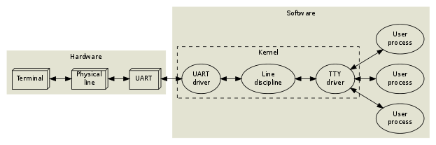
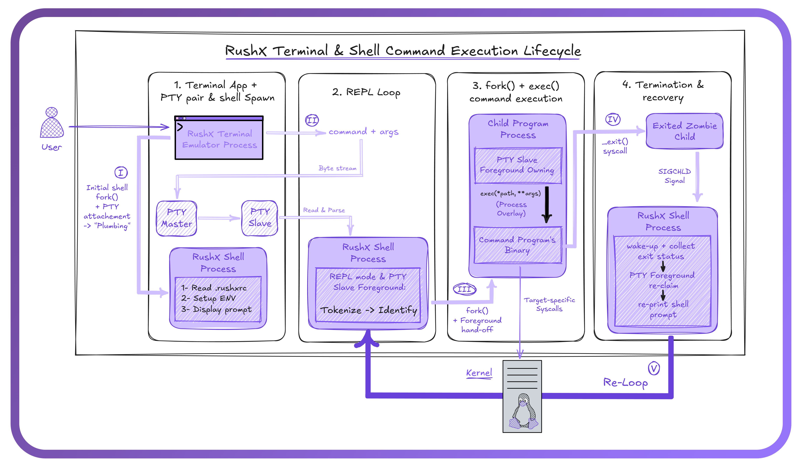
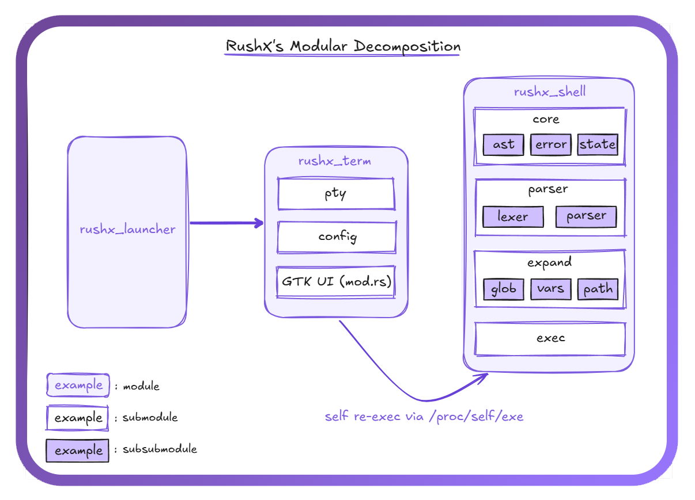
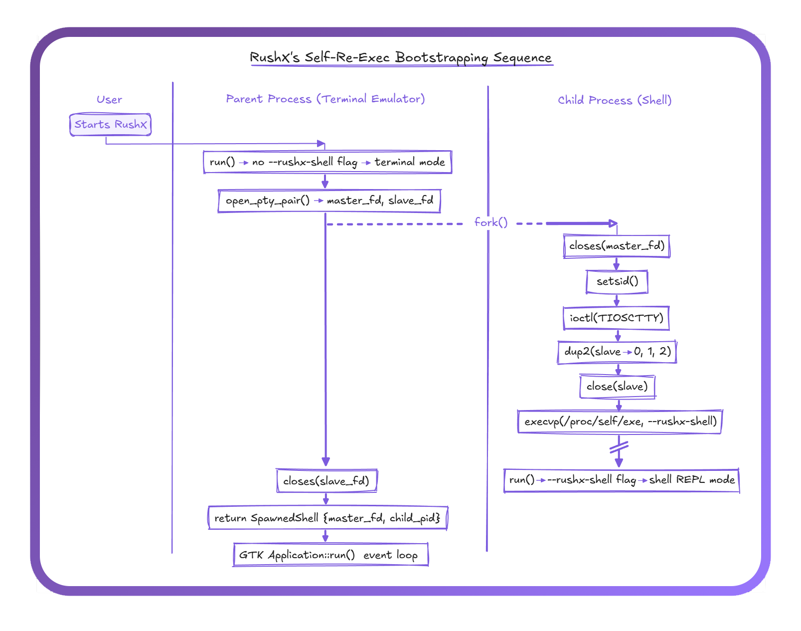
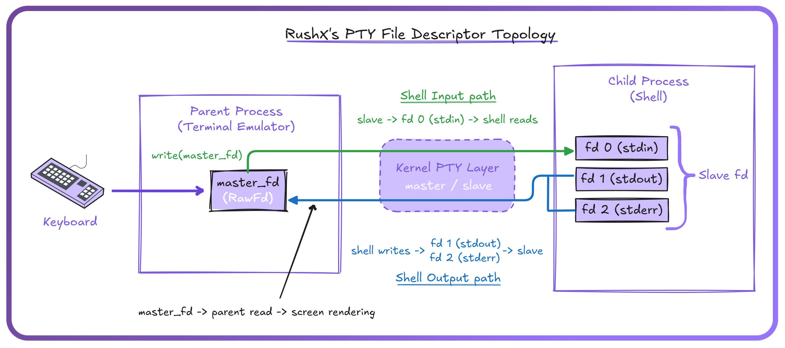
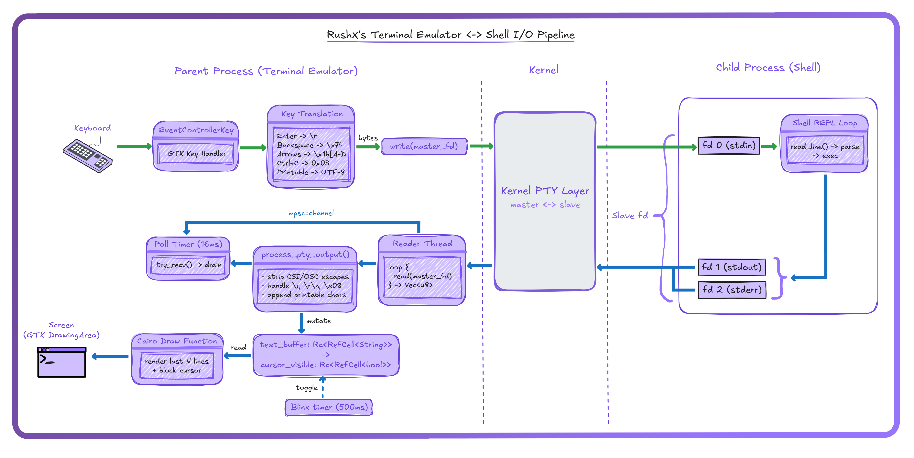
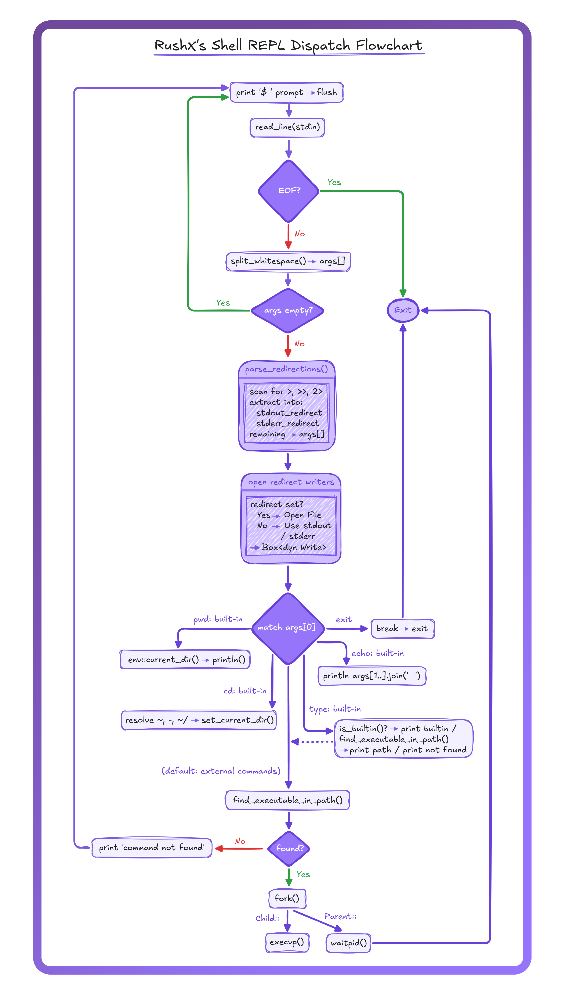

# RushX

### Overview

RushX (Rust Shell - eXtended) is a POSIX-compliant Linux <ins>**terminal emulator**</ins> & <ins>**shell**</ins> implemented in Rust. It ships as a single binary: A GTK4-based terminal emulator that allocates a pseudoterminal (PTY) and renders output via Cairo, and calls by default an interactive POSIX-style shell that performs tokenization, redirection parsing, builtin dispatch, and `fork(2)`/`execvp(3)` execution of external commands.

RushX interfaces directly with the Linux kernel for process creation, session management, and controlling terminal assignment. No external libraries handle PTY allocation, signal delivery, or process lifecycle, and the <ins>**_nix_**</ins> crate provides safe Rust wrappers around the main syscalls, while raw <ins>**_libc::ioctl_**</ins> is used where no safe wrapper exists.

> Developed & Maintained by [The HaiKaw Pr0tocol](https://github.com/The-HaiKaw-Pr0tocol) organization.

## RushX's Logo

<div align="center">
    
</div>

## Authors

<div align="center">

<table>
  <tr>
    <td align="center">
        <br />
        <b>Kawtar Taik</b> <br />
            
            <span>
                <a href="https://github.com/kei077"></a>
            </span>
            <br /> <br />
            <a href="https://github.com/kei077" title="GitHub">
                
            </a>
            <a href="https://www.linkedin.com/in/kawtar-ta%C3%AFk-7544a11b9/" 
            title="LinkedIn">
                
            </a>
            <a href="mailto:kawtartaik123@gmail.com" 
            title="Email">
                
            </a>
      <br />
    </td>
    <td align="center">
        <br />
        <b>Haitam Bidiouane</b> <br />
            
            <span>
                <a href="https://github.com/sch0penheimer"></a>
            </span>
            <br /> <br />
            <a href="https://github.com/sch0penheimer" title="GitHub">
                
            </a>
            <a href="https://www.linkedin.com/in/haitam-bidiouane" 
            title="LinkedIn">
                
            </a>
            <a href="mailto:h.bidiouane@gmail.com"
            title="Email">
                
            </a>
      <br />
    </td>
  </tr>
</table>

</div>

---

## Table of Contents

- [1. Introduction & Motivation](#1-introduction--motivation)
- [2. Architecture](#2-architecture)
  - [2.1 Modular Decomposition](#21-modular-decomposition)
  - [2.2 Single-Binary Self-Re-Exec Model](#22-single-binary-self-re-exec-model)
- [3. Terminal Emulator (`rushx_term`)](#3-terminal-emulator-rushx_term)
  - [3.1 PTY Allocation & Session Establishment](#31-pty-allocation--session-establishment)
  - [3.2 PTY File Descriptor Topology](#32-pty-file-descriptor-topology)
  - [3.3 Terminal I/O Pipeline](#33-terminal-io-pipeline)
  - [3.4 Configuration](#34-configuration)
- [4. Shell (`rushx_shell`)](#4-shell-rushx_shell)
  - [4.1 REPL Loop](#41-repl-loop)
  - [4.2 Parsing](#42-parsing)
  - [4.3 Builtin Commands](#43-builtin-commands)
  - [4.4 External Command Execution](#44-external-command-execution)
  - [4.5 I/O Redirection Mechanism](#45-io-redirection-mechanism)
- [5. POSIX Compliance & Syscall Interface](#5-posix-compliance--syscall-interface)
- [6. Project Status & Roadmap](#6-project-status--roadmap)
  - [6.1 Implementation Status Matrix](#61-implementation-status-matrix)
  - [6.2 Known Limitations](#62-known-limitations)
  - [6.3 Roadmap](#63-roadmap)
- [7. Building & Installation](#7-building--installation)
  - [7.1 Build from Source](#71-build-from-source)
  - [7.2 Install via APT](#72-install-via-apt)
- [8. License](#8-license)
- [9. References](#9-references)

---

## 1. Introduction & Motivation

<div align="center">
    
</div>

<div align="center">

_How classic terminals input/output flows: from the physical terminal over UART into the kernel’s TTY stack (driver + line discipline), and then to user processes. Source: [Terminal Emulators Under the Hood](https://funinkina.is-a.dev/blog/terminal-emulators-under-the-hood/)._

</div>

<br/>

Early UNIX systems used **physical terminals** connected over serial lines. The kernel exposed them through the **TTY subsystem**, giving programs a uniform byte-stream interface.

As hardware terminals disappeared, <ins>**terminal emulators**</ins> is what replaced them, and to preserve the TTY abstraction, UNIX introduced **pseudoterminals (PTYs)**: the emulator talks to the _PTY master process_, while shells and programs attach to the _slave side_ as if it were a **real terminal**.

---

Now mosst terminal emulators treat the shell as an opaque subprocess, while shells assume an existing terminal. This creates a strict split: terminal emulator ↔ PTY ↔ shell.

**RushX collapses this split into a single binary.** One process owns PTY setup, session creation, byte-level I/O, `fork`/`exec`, and child reaping, merging terminal and shell into one program.

<br/>

## 2. Architecture

<div align="center">



_**Figure 1**: RushX Terminal & Shell Command Execution Lifecycle - Architecture overview depicting the five-phase process flow._

</div>

> [!IMPORTANT]
> This represents our current architectural vision for RushX. As development progresses, this design may evolve based on implementation discoveries.

<br/>

Well, the considered full command execution lifecycle of RushX could be mainly sectioned into five phases:

- **_Phase I_: <ins>Terminal startup, PTY plumbing, and shell spawn</ins>**

The terminal emulator process allocates a PTY master/slave pair from the Kernel, then forks and re-execs itself to spawn the shell as a child process attached to the PTY slave side. The shell then sets up its environment, and prints the prompt. This is the "plumbing" stage: after it completes, the master fd belongs to the emulator and the slave fd is wired to the shell's **stdin/stdout/stderr**.

- **_Phase II_: <ins>REPL loop</ins>**

The user types a command into the terminal window. Keystrokes travel through the PTY master into the slave, where the shell reads a line as a byte stream, tokenizes it, and identifies whether it maps to a builtin or an external program.

- **_Phase III_: <ins>fork/exec command execution</ins>**

For external commands, the shell calls `fork(2)` to create a child program process that inherits the PTY slave as its foreground terminal. The child then calls `exec(*path, **args)` to overlay itself with the target binary. The running program issues its own syscalls against the kernel directly.

- **_Phase IV_: <ins>Termination and recovery</ins>**

When the child calls `_exit()`, it becomes a zombie. The kernel delivers `SIGCHLD` to the shell, which wakes up, collects the exit status via `waitpid(2)`, reclaims PTY foreground ownership, and reprints the prompt.

- **_Phase V_: <ins>Re-loop</ins>**

Control returns to Phase II. The shell waits for the next line of input.

Every external command repeats Phases II through V. The PTY pair established in Phase I persists for the lifetime of the terminal session, serving as the single communication channel between the emulator and the shell. The emulator never interprets commands; the shell never renders pixels. Each process owns exactly one side of the PTY and one half of the responsibility.

<br/>

### 2.1 Modular Decomposition

<div align="center">
    
</div>

<div align="center">

_**Figure 2**: RushX module hierarchy. Rounded boxes: top-level modules. Solid-border boxes: submodules. Inner boxes: subsubmodules._

</div>

<br/>

Figure 2 maps out the full module tree. RushX is partitioned into 3 top-level modules ( for now :) ), each declared in [main.rs](./src/main.rs) and routed through the **rushx_launcher** module:

1. **`rushx_launcher`** is the thinnest layer. It contains a single function : **run()**, that inspects **_argv_** for an experimental <ins>**--rushx-shell**</ins> flag and branches into either **rushx_term::run_rushx_terminal()** or **rushx_shell::run_rushx_shell()**. No other logic lives here. Its used to test the shell independently and to kind of fork the shell process from the same binary when the terminal emulators spawns it.

---

2. **`rushx_term`** is the terminal emulator. Its root : [mod.rs](./src/rushx_term/mod.rs) builds the GTK4 window, wires the I/O pipeline (reader thread, poll timer, draw function, blink timer, keyboard handler), and runs the **process_pty_output()** state machine that strips escape sequences and feeds characters to the Cairo renderer. Two submodules support it:

   - **2.1** _<ins>`pty`</ins>_ : Allocates the PTY master/slave pair and spawns the shell child process via fork/exec.

   - **2.2** _<ins>`config`</ins>_ : Defines compile-time constants: application ID, window geometry, colors, font, shell path (**_/proc/self/exe_**), shell flag (**_--rushx-shell_**), and buffer sizes.

---

3. **`rushx_shell`** is the RushX shell. Its root [mod.rs](./src/rushx_shell/mod.rs) runs the REPL loop: print prompt, read line, dispatch to builtin or external command. Four submodules handle the rest:

   - **3.1** _<ins>`parser`</ins>_ : Implements the quote-aware argument tokenizer and the redirection parser. **lexer.rs** is scaffolded for a future token-stream lexer but currently empty.

   - **3.2** _<ins>`exec`</ins>_ : Implements **run_external()** (fork, fd redirection via **open/dup2**, **execvp**, **waitpid**), **find_executable_in_path()**, and **is_builtin()**.

   - **3.3** _<ins>`core`</ins>_ (scaffolded) : [ast.rs](./src/rushx_shell/core/ast.rs), [error.rs](./src/rushx_shell/core/error.rs), and [state.rs](./src/rushx_shell/core/state.rs) exist as empty files reserved for AST node definitions, structured error types, and shell state (variables, exit codes, options).

   - **3.4** _<ins>`expand`</ins>_ (scaffolded) : [glob.rs](./src/rushx_shell/expand/glob.rs), [vars.rs](./src/rushx_shell/expand/vars.rs), and [path.rs](./src/rushx_shell/expand/path.rs) are reserved for glob expansion, variable/tilde expansion, and PATH resolution respectively.

<br/>

### 2.2 Single-Binary Self-Re-Exec Model

<div align="center">
    
</div>

<div align="center">

_**Figure 3**: Self-re-exec bootstrapping sequence. Left swimlane: parent process (terminal emulator). Right swimlane: child process (shell). Dashed arrow marks the fork(2) boundary._

</div>

<br />

Figure 3 traces the bootstrapping sequence step by step. The entire ceremony happens inside <ins>**spawn_shell()**</ins> in [pty.rs](src/rushx_term/pty.rs), called once at terminal startup.

The parent process (terminal emulator) begins by calling **openpty(3)** to allocate a PTY master/slave pair. It then prepares the **CString** arguments for **execvp** while still single-threaded, before any **fork(2)**. 

> [!CAUTION]
> This is important: heap allocation after fork is unsafe in a multithreaded process, so all `CString` construction happens on the parent side.

The parent then calls **fork(2)**. From this point, two processes exist with identical memory.

**Child path (right swimlane):**

1. Close the master fd. The child has no use for it.
2. ***setsid(2)*** to create a new session. The child becomes session leader, detached from the parent's controlling terminal.
3. ***ioctl(slave_fd, TIOCSCTTY)*** to claim the PTY slave as the session's controlling terminal. This is a raw `libc::ioctl` call because no safe Rust wrapper exists.
4. ***dup2(slave_fd, 0)***, ***dup2(slave_fd, 1)***, ***dup2(slave_fd, 2)*** to wire stdin, stdout, and stderr to the slave.
5. Close the original slave fd (it is now duplicated onto fds 0, 1, 2).
6. ***execvp("/proc/self/exe", ["rushx", "--rushx-shell"])*** to overlay the child's memory with a fresh invocation of the same binary. The **--rushx-shell** flag causes ***rushx_launcher::run()*** to branch into ***rushx_shell::run_rushx_shell()*** instead of launching another terminal window.

If ***execvp*** fails, the child calls ***libc::_exit(1)*** directly to avoid running Rust destructors or ***atexit*** handlers in the forked address space.

**Parent path (left swimlane):**

1. Close the slave fd. Only the child uses it.
2. Return `SpawnedShell { master_fd, child_pid }` to the terminal emulator, which uses ***master_fd*** for all subsequent I/O and ***child_pid*** for lifecycle management.

The key insight is that `/proc/self/exe` always points to the currently running binary. The child does not spawn an external shell; it re-executes itself. The flag in ***argv*** is the only thing that distinguishes a terminal emulator process from a shell process.

<br />

---

## 3. Terminal Emulator (`rushx_term`)

### 3.1 PTY Allocation & Session Establishment

<!-- TODO -->

### 3.2 PTY File Descriptor Topology

<div align="center">
    
</div>

<div align="center">

_**Figure 4**: PTY file descriptor topology. Green arrows: shell input path (keyboard to stdin via master/slave). Blue arrows: shell output path (stdout/stderr through slave to master for screen rendering)._

</div>

<!-- TODO -->

### 3.3 Terminal I/O Pipeline

<div align="center">
    
</div>

<div align="center">

_**Figure 5**: Terminal emulator bidirectional I/O pipeline. Left half: parent process (GTK main thread + reader thread). Center: kernel PTY layer. Right half: child process (shell REPL loop)._

</div>

#### 3.3.1 Reader Thread

<!-- TODO -->

#### 3.3.2 Poll Timer

<!-- TODO -->

#### 3.3.3 PTY Output Processing

<!-- TODO -->

#### 3.3.4 Rendering

<!-- TODO -->

#### 3.3.5 Keyboard Input

<!-- TODO -->

### 3.4 Configuration

<!-- TODO -->

---

## 4. Shell (`rushx_shell`)

### 4.1 REPL Loop

<div align="center">
    
</div>

<div align="center">

_**Figure 6**: Shell REPL dispatch flowchart. Diamonds: branch conditions. Rounded boxes: operations. Green arrows: normal flow. Red arrows: error/exit paths._

</div>

<!-- TODO -->

### 4.2 Parsing

#### 4.2.1 Argument Tokenization

<!-- TODO -->

#### 4.2.2 Redirection Parsing

<!-- TODO -->

### 4.3 Builtin Commands

<!-- TODO -->

### 4.4 External Command Execution

#### 4.4.1 PATH Resolution

<!-- TODO -->

#### 4.4.2 Fork/Exec Lifecycle

<!-- TODO -->

### 4.5 I/O Redirection Mechanism

<!-- TODO -->

---

## 5. POSIX Compliance & Syscall Interface

<!-- TODO -->

---

## 6. Project Status & Roadmap

### 6.1 Implementation Status Matrix

<!-- TODO -->

### 6.2 Known Limitations

<!-- TODO -->

### 6.3 Roadmap

<!-- TODO -->

---

## 7. Building & Installation

### 7.1 Build from Source

<!-- TODO -->

### 7.2 Install via APT

```bash
curl -fsSL https://raw.githubusercontent.com/The-HaiKaw-Pr0tocol/rushx/main/install.sh | sudo bash

sudo apt-get install -y rushx
```

---

## 8. License

<!-- TODO -->

---

## 9. References

<!-- TODO -->
